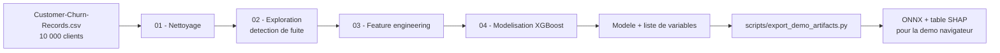

# Architecture et spécifications techniques

Ce document décrit la chaîne de traitement, les variables construites, la stratégie
de modélisation et — surtout — les biais méthodologiques identifiés dans ce projet.

---

## 1. Chaîne de traitement



Chaque notebook écrit le fichier consommé par le suivant : la chaîne est
reproductible en les exécutant dans l'ordre.

---

## 2. La fuite de données, et pourquoi elle domine tout le reste

Le jeu contient une colonne `complain` **corrélée à 1,00 avec la cible**.

```
complain : (r=1.00) => data leakage
```

### Pourquoi c'est une fuite et non un bon prédicteur

Une réclamation est enregistrée **au moment où, ou après que**, le client part. La
variable n'est pas disponible à l'instant où l'on voudrait prédire le départ : le
modèle « prédirait » le passé.

Conservée, elle produit un modèle à ~99 % de justesse, parfaitement inutile en
production. C'est le piège classique de ce jeu Kaggle.

### Comment la détecter

Une matrice de corrélation avec la cible suffit. Une corrélation de 1,00 avec la
variable à prédire n'est jamais une bonne nouvelle : c'est le signal qu'une
information postérieure au fait s'est glissée dans les données.

**Toutes les métriques de ce dépôt sont donc plus basses que ce que ce jeu de
données peut afficher. C'est volontaire.**

---

## 3. Variables construites

Le projet ne modélise pas les colonnes brutes : il construit des variables portant
une hypothèse métier.

| Famille | Exemples | Hypothèse |
| --- | --- | --- |
| Drapeaux de risque | `medium_balance_risk`, `low_credit_score_risk` | des seuils repérés à l'exploration isolent des segments à risque |
| Segmentation d'âge | `age_bin` | le risque n'est pas linéaire en l'âge |
| Interactions | `product_1_AND_germany`, `product_1_AND_female` | le risque naît d'une combinaison, pas d'un facteur isolé |
| Ratios métier | `balance_to_salary_ratio`, `balance_per_product` | un solde s'interprète relativement au revenu |
| Engagement | `product_engagement_score`, `product_1_inactive` | l'inactivité est le signal le plus fort |

Le modèle final retient **neuf variables**, sélectionnées par importance.

---

## 4. Modélisation

| Étape | Choix |
| --- | --- |
| Algorithme | `XGBClassifier` |
| Découpage | 80 / 20 stratifié sur la cible |
| Déséquilibre | `scale_pos_weight` = ratio non-churn / churn |
| Sélection de variables | top 9 par importance du modèle de référence |
| Seuil de décision | choisi sur la courbe précision/rappel |

### Le compromis assumé

Perdre un client coûte plus cher que contacter inutilement un client fidèle. Le
seuil est donc déplacé pour privilégier le **rappel** sur la classe churn, au prix
de la précision.

| Métrique | Valeur | Lecture |
| --- | ---: | --- |
| ROC-AUC | 0,866 | **la seule indépendante du seuil** |
| Rappel churn | 0,90 | le seuil a été *choisi* pour l'atteindre |
| Précision churn | ≈ 0,36 | environ deux contacts sur trois sont inutiles |

---

## 5. Biais méthodologiques identifiés

Cette section existe parce que ces biais sont réels et qu'ils affectent les chiffres
annoncés. Les taire donnerait un dépôt plus flatteur et moins honnête.

### 5.1 Le rappel de 0,90 est en partie tautologique

Le notebook cherche sur la courbe précision/rappel le point où le rappel vaut 0,9 :

```python
target_recall = 0.9
idx = np.argmin(np.abs(rec - target_recall))
best_threshold = thresholds[idx]
```

Rapporter ensuite « 0,90 de rappel » revient à annoncer la valeur qu'on a
demandée. **La métrique porteuse d'information ici est le ROC-AUC de 0,866**, qui ne
dépend pas du seuil, et la précision de 0,36 que ce point d'opération coûte.

### 5.2 Le seuil est choisi sur l'échantillon d'évaluation

Le seuil est optimisé sur le jeu de test, puis les performances sont rapportées sur
ce même jeu. La bonne pratique serait : seuil choisi sur un jeu de validation ou par
validation croisée, puis **une seule** évaluation sur un test intact.

### 5.3 Les variables sont conçues sur le jeu complet

Le notebook 03 construit les variables avant tout découpage :

- les seuils des drapeaux de risque (solde 100–140 k, score de crédit ≤ 450) sont
  choisis d'après l'exploration menée sur **toutes** les lignes ;
- les combinaisons d'interaction sont retenues en les classant par taux de départ
  observé sur toutes les lignes ;
- `high_balance_inactive` et `senior_high_balance` utilisent
  `df['balance'].quantile(0.75)`, calculé sur train **et** test.

Le jeu de test contient donc de l'information ayant servi à concevoir les variables.
Les métriques sont optimistes.

### 5.4 Les hyperparamètres apparaissent sans le code qui les a produits

Le modèle final utilise `n_estimators=342, gamma=0.272814…`. La recherche qui a
produit ces valeurs n'est pas versionnée. Elle devrait l'être.

### 5.5 Pas de validation croisée, pas de modèle de référence

Aucune validation croisée, et aucune régression logistique de référence. Sans point
de comparaison, un ROC-AUC de 0,866 n'a pas d'échelle : est-ce bon pour ce problème ?

---

## 6. Artefacts de la démonstration navigateur

La démonstration du portfolio exécute le modèle côté client. Deux artefacts,
produits par `scripts/export_demo_artifacts.py` :

| Artefact | Rôle |
| --- | --- |
| `xgb_churn_model.onnx` | modèle converti pour `onnxruntime-web` |
| `shap_lookup.json` | valeurs SHAP pré-calculées sur les 21 216 scénarios de la grille |

SHAP ne peut pas s'exécuter dans un navigateur : les valeurs sont donc calculées
hors ligne sur le produit cartésien exact des contrôles de la démonstration. La
saisie de l'utilisateur est **arrondie au point de grille le plus proche**.

### Une précision d'affichage

Les valeurs SHAP s'expriment en **log-odds**. Les afficher telles quelles suivies
d'un signe `%` serait faux — l'interface montre donc la **part de chaque variable
dans le total des contributions absolues**, qui somme bien à 100 %.

---

## 7. Ce qu'il faudrait pour une version production

Par ordre d'impact :

1. Découper avant tout feature engineering ; ajuster quantiles et seuils sur le
   train seul.
2. Choisir le seuil sur un jeu de validation, évaluer une seule fois sur un test
   intact.
3. Ajouter une régression logistique de référence et une validation croisée.
4. Versionner la recherche d'hyperparamètres.
5. Valoriser la matrice de confusion en euros : coût d'un client perdu contre coût
   d'un contact inutile. C'est ce qui fixe le seuil, pas une cible arbitraire.
6. Sortir la chaîne des notebooks vers un `src/` testé.
7. Calibrer les probabilités si elles doivent être interprétées comme telles.
