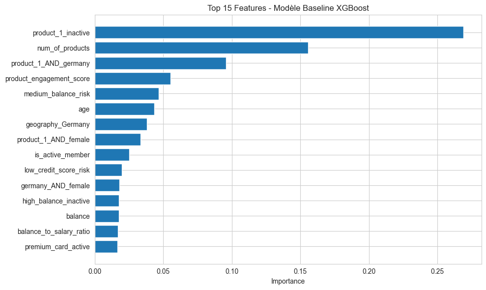
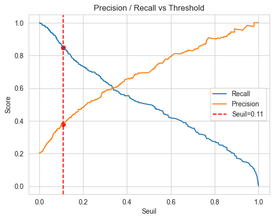

# Customer Churn Prediction

End-to-end machine-learning case study for identifying bank customers at risk of churn and translating model outputs into actionable retention priorities.

> **Context:** personal / academic machine-learning project built from a public Kaggle dataset. The goal is to demonstrate a complete data-science workflow rather than present a production banking system.

## Project highlights

- Cleaned and validated a dataset of **10,000 customer records**.
- Performed exploratory analysis to identify behavioral and demographic churn patterns.
- Built domain-inspired features and interaction variables.
- Trained and evaluated an **XGBoost** classifier on an imbalanced binary target.
- Reduced the model to **9 high-value features** to improve interpretability.
- Adjusted the decision threshold to prioritize churn detection.
- Reached **0.866 ROC-AUC** and approximately **0.90 recall** for the churn class in the recorded notebook run.

## Business objective

Customer acquisition is usually more expensive than targeted retention. The modeling objective is therefore not only to maximize overall accuracy, but to identify as many likely churners as possible while keeping the false-positive rate operationally manageable.

The project focuses on three questions:

1. Which customer profiles are most associated with churn?
2. Can churn risk be predicted with useful discrimination?
3. How should the classification threshold change when missing a churner is more costly than contacting a non-churner?

## Workflow

```text
Raw CSV
   ↓
Data cleaning & validation
   ↓
Exploratory data analysis
   ↓
Feature engineering
   ↓
Train / test split
   ↓
XGBoost modeling
   ↓
Feature selection & class weighting
   ↓
Decision-threshold tuning
   ↓
Business interpretation
```

## Results

| Metric | Recorded result | Interpretation |
| --- | ---: | --- |
| ROC-AUC | **0.866** | Good discrimination between churn and non-churn customers |
| Churn recall | **0.90** | Around 90% of churners are detected |
| Churn precision | **~0.36** | More false positives are accepted to reduce missed churners |
| Churn F1-score | **~0.51** | Reflects the deliberate recall-oriented trade-off |

The baseline model reached approximately **0.848 ROC-AUC** and **0.50 churn recall** before the recall-oriented optimization steps.





## Key findings from the analysis

The exploratory and modeling notebooks highlight several recurring risk patterns in this dataset, including:

- inactivity as an important churn signal;
- strong differences across number of products held;
- elevated risk for some age ranges;
- interaction effects involving geography, gender and product usage;
- customer engagement variables contributing useful predictive information.

The final reduced model uses nine features, with the strongest recorded importance assigned to variables such as `product_1_inactive`, `num_of_products`, `product_1_AND_germany` and `product_engagement_score`.

## Feature engineering

The project goes beyond raw-column modeling and creates several types of features:

- **risk flags** for customer segments identified during EDA;
- **age bins**;
- **interaction variables** between high-risk characteristics;
- **business-oriented ratios and engagement indicators**;
- one-hot encoded categorical variables used by the classifier.

Examples include:

```text
product_1_inactive
product_1_AND_germany
product_engagement_score
balance_to_salary_ratio
balance_per_product
satisfaction_engagement
```

## Repository structure

```text
.
├── assets/
│   ├── feature_importance.png
│   └── precision_recall_threshold.png
├── data/
│   ├── raw/
│   ├── preprocessed/
│   └── README.md
├── model/
│   └── README.md
├── notebooks/
│   ├── 01_data_cleaning.ipynb
│   ├── 02_exploratory_analysis.ipynb
│   ├── 03_feature_engineering.ipynb
│   └── 04_modeling.ipynb
├── .gitignore
├── README.md
└── requirements.txt
```

## Notebooks

### 01 — Data cleaning

- dataset inspection;
- column normalization;
- missing-value checks;
- distribution analysis;
- consistency checks;
- preparation of the cleaned dataset.

### 02 — Exploratory analysis

- churn rate by categorical and numerical variables;
- correlation analysis;
- identification of behavioral patterns;
- business interpretation of high-risk segments.

### 03 — Feature engineering

- risk flags;
- age segmentation;
- interaction features;
- business ratios and engagement scores;
- removal of identifiers and non-retained columns.

### 04 — Modeling

- XGBoost baseline;
- feature importance analysis;
- reduction to nine features;
- class imbalance handling;
- recall-oriented threshold selection;
- tuned XGBoost configuration;
- model and feature-list export.

## Tech stack

- **Python 3.11+**
- **Pandas / NumPy** — data manipulation
- **Matplotlib / Seaborn** — exploratory visualization
- **Scikit-learn** — splitting and evaluation metrics
- **XGBoost** — gradient-boosted classification
- **Jupyter Notebook** — analysis environment
- **Joblib** — model serialization

## Reproduce the project

### 1. Clone the repository

```bash
git clone <your-repository-url>
cd customer-churn-prediction
```

### 2. Create a virtual environment

```bash
python -m venv .venv
```

Linux / macOS:

```bash
source .venv/bin/activate
```

Windows PowerShell:

```powershell
.venv\Scripts\Activate.ps1
```

### 3. Install dependencies

```bash
pip install -r requirements.txt
```

### 4. Download the dataset

Dataset source:
https://www.kaggle.com/datasets/kartiksaini18/churn-bank-customer

Place the downloaded file at:

```text
data/raw/Customer-Churn-Records.csv
```

### 5. Run the notebooks in order

```text
01_data_cleaning.ipynb
02_exploratory_analysis.ipynb
03_feature_engineering.ipynb
04_modeling.ipynb
```

Each notebook generates the input required by the next step.

## Methodology note

This repository is an exploratory portfolio project. In the recorded modeling notebook, threshold selection is performed using the evaluation sample to study the precision/recall trade-off. For a production-grade experiment, I would use a dedicated validation set or cross-validation for feature selection, hyperparameter tuning and threshold selection, and reserve a final untouched test set for unbiased reporting.

Further improvements could include:

- SHAP-based model interpretation;
- probability calibration;
- cost-sensitive threshold optimization using real retention/acquisition costs;
- comparison with LightGBM and logistic-regression baselines;
- experiment tracking and a reproducible training script outside notebooks;
- automated tests for the feature pipeline.

## Author

**Jules Courné**  
Data Analyst / Data Engineer  
GitHub: https://github.com/juleescourne
