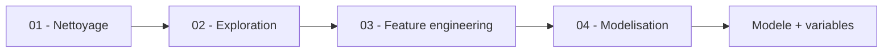

> **Évaluation de référence :** `scripts/evaluate.py`, exécuté sur les données brutes.
> Voir le [rapport](reports/evaluation.json) et le [README](README.md). Les notebooks
> et résultats décrits ci-dessous concernent l’exploration historique.

# Guide d'utilisation

Ce guide explique ce que fait chaque notebook, comment lire les résultats, et
comment ne pas surinterpréter les métriques.

---

## Parcours



---

## 1. Nettoyage — `01_data_cleaning.ipynb`

Inspection du jeu, normalisation des noms de colonnes, contrôle des valeurs
manquantes, analyse des distributions, contrôles de cohérence.

Sortie : `data/preprocessed/01_churn_records.csv`.

---

## 2. Exploration — `02_exploratory_analysis.ipynb`

**C'est le notebook le plus important du projet.**

Taux de départ par variable, corrélations, identification des segments à risque.

### La découverte qui change tout

```
complain : (r=1.00) => data leakage
```

Dans le fichier enrichi historique, `complain` présente une corrélation arrondie à 1,00 avec la cible. C’est un signal de fuite potentielle, pas une preuve de chronologie : le dépôt ne fournit pas l’horodatage des réclamations. La variable est exclue par prudence. Le fichier brut de l’évaluation de référence ne la contient pas.

Pour conclure à une fuite temporelle, il faudrait vérifier la définition, la provenance et la disponibilité de cette variable à l’instant de prédiction.

---

## 3. Feature engineering — `03_feature_engineering.ipynb`

Construction des variables portant une hypothèse métier : drapeaux de risque,
segmentation d'âge, interactions, ratios, scores d'engagement.

Exemples :

```text
product_1_inactive          client à un seul produit et inactif
product_1_AND_germany       interaction produit unique × Allemagne
product_engagement_score    nombre de produits × activité
balance_to_salary_ratio     solde rapporté au revenu
```

> **Limite de méthode.** Ces variables sont construites sur le jeu **complet**,
> avant tout découpage. Les seuils et quantiles utilisés intègrent donc de
> l'information issue du jeu de test. Voir
> [ARCHITECTURE.md](ARCHITECTURE.md#53-les-variables-sont-conçues-sur-le-jeu-complet).

---

## 4. Modélisation — `04_modeling.ipynb`

Modèle de référence XGBoost, analyse d'importance, réduction à neuf variables,
pondération des classes, choix du seuil.


### Choisir le seuil


L’exploration fait l’hypothèse qu’un départ manqué coûte plus qu’un contact inutile et privilégie le rappel. Aucun coût métier n’a été fourni pour valider cette hypothèse.

| Métrique | Valeur | Comment la lire |
| --- | ---: | --- |
| **ROC-AUC** | **0,866** | mesure de classement indépendante du seuil ; elle ne décrit ni la calibration ni le coût métier |
| Rappel churn | 0,90 | le seuil a été *choisi* pour l'atteindre : ce n'est pas un résultat indépendant |
| Précision churn | ≈ 0,36 | environ deux contacts sur trois seront inutiles |
| F1 churn | ≈ 0,51 | reflète le compromis assumé |

### Lire correctement ces chiffres

Le notebook cherche le point de la courbe où le rappel vaut 0,9, puis rapporte
0,90 de rappel. **C'est une tautologie.** La question utile n'est pas « quel rappel
atteint-on ? » mais « à quel prix ? » — et la réponse est : 36 % de précision.

Avec une précision exploratoire de 36 %, environ 2,8 alertes correspondent à un départ observé. Cela ne mesure aucun départ évité. Pour choisir un seuil économique, il faut connaître le coût de contact, la valeur d’une rétention et l’effet incrémental d’une campagne, mesuré avec un groupe témoin.

---

## 5. Résultats métier

Variables les plus prédictives du modèle réduit :

| Variable | Lecture |
| --- | --- |
| `product_1_inactive` | client à produit unique et inactif — le signal le plus fort |
| `num_of_products` | le risque varie fortement selon le nombre de produits |
| `product_1_AND_germany` | l'effet du produit unique est amplifié en Allemagne |
| `product_engagement_score` | association avec un taux de départ plus faible dans ce jeu |
| `age` | le risque n'est pas linéaire en l'âge |

Ces variables décrivent des **associations** dans ce jeu de données. Elles ne
démontrent pas qu'agir sur l'une d'elles réduirait les départs : seule une
expérimentation contrôlée le montrerait.

---

## 6. La démonstration navigateur

<https://juleescourne.github.io/portfolio-data-analyst/#/churn>

Le modèle tourne côté client via ONNX. Le panneau d'explication affiche des valeurs
SHAP **pré-calculées** sur une grille de scénarios : la saisie est arrondie au point
de grille le plus proche.

Les contributions sont affichées en **part du total des contributions absolues**, et
non en valeur SHAP brute : celle-ci s'exprime en log-odds, qu'un signe `%` rendrait
faux.

Pour reconstruire ces artefacts : voir
[INSTALLATION.md](INSTALLATION.md#reconstruire-les-artefacts-de-la-démonstration).
